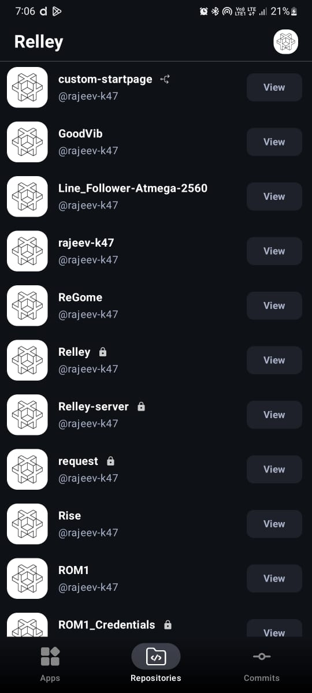
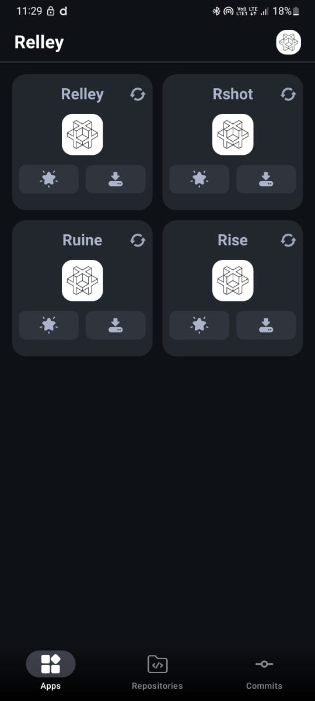
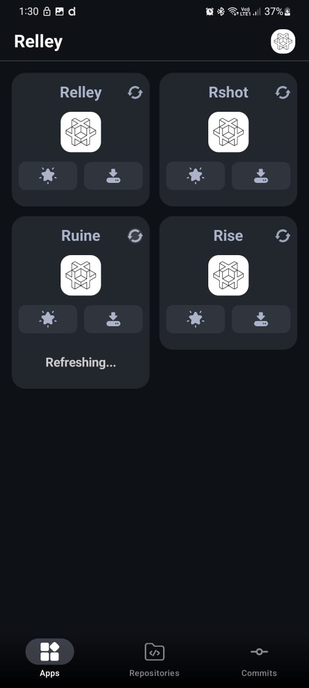
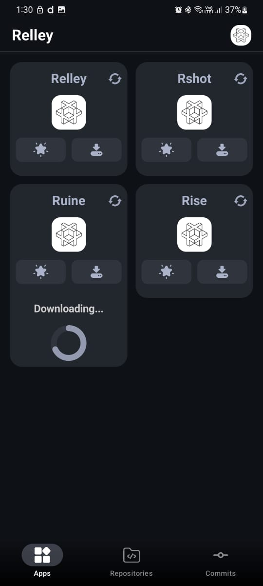
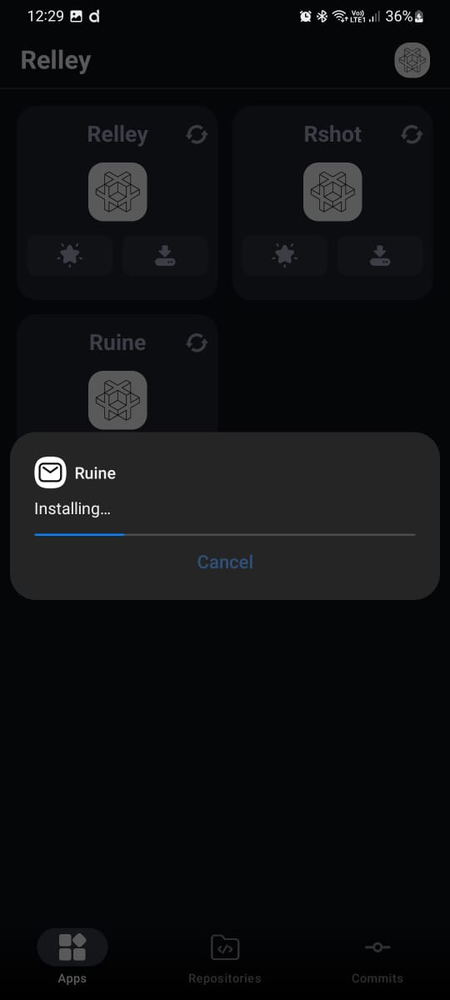

# Relley (An accessibility app for all android developers) 

* Relley is an Android application which helps in testing android application seamlessly . 
* Develop android app push them to github andRelley will automatically installs it for you in your testing device. 😊

## Features
* **Access Repositories**: Access and view your all repositories after adding relley app to your github account and authorizing it .
* **Android projects** : Automatically gets you through android projects and finds the apks inside a specific github directory `/app/release/[app].apk`
* **Install Apk file** : Seamlessly downloads and install your testing application in android devices.
* **Star apk** : Star apks to access them, refreshing and downloading them easily.

## Tech stack :
  * **Jetpack compose** for UI design and data flow.
  * **Kotlin** for main logic structure.
  * **Okhttp,coil** for api calls and Seamless image loading respectively.
  * **Shared preferences** for storing keys and data.

**Permissions Required** :

  * **Internet** : Fetching and downloading apk.
  * **Github app** : Install Relley app in your github account which is included in auth flow for accessing private repositories.

## Key Features and Samples
   ### Requirement :
  Their must be a directory named `app/release/` for Relley to work and the apk should be placed inside it.

  #### Install Latest Release from [Releases](https://github.com/rajeev-k47/Relley/releases).
  
* **Login :**
   Login through github
   
   

* **Repositories and starred apks :**
  
  View your all repositories and starred apks .
  
                                            

 **Refresh and Download :**
  
  Refresh and download the newly committed apk.
  
                                         

  Automatically installs the application after downloading.

   

  
  
Fork the repository.

Create a new branch (git checkout -b myBranch).

Commit your changes (git commit -m 'Add some feature').

Push to the branch (git push origin myBranch).

Open a pull request.
